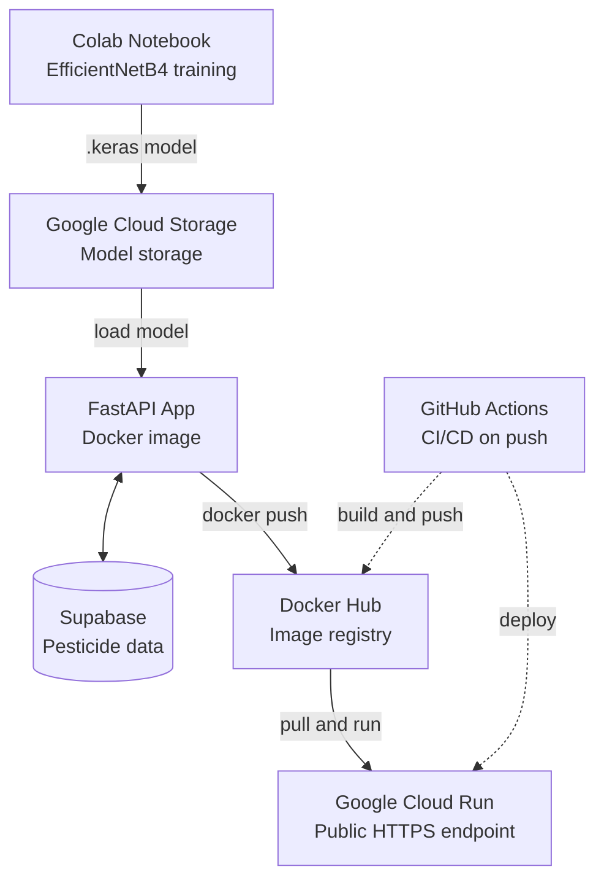

# Crop Disease Classification using Transfer Learning

https://github.com/user-attachments/assets/c972094d-6ca3-4ce3-9e21-1ae36f502251

An end-to-end machine learning project that takes a crop leaf image classifier from a Colab notebook to a live, production-deployed REST API — complete with a web interface, pesticide recommendations, and an automated CI/CD pipeline.

## Overview
This project classifies crop leaf images into 39 categories (38 disease classes across 14 crop species, plus a "no leaf" background class) and returns a matched pesticide/treatment recommendation sourced from official agricultural guidance. The model is trained using transfer learning and deployed as a containerized, serverless REST API on Google Cloud Run, with an automated build-and-deploy pipeline via GitHub Actions.

## Features
1. Image classification — identifies crop disease from an uploaded leaf photo
2. Pesticide recommendation — matches the predicted disease to a treatment recommendation, sourced from the Sri Lanka Department of Agriculture's Pesticide Recommendations (2019)
3 Web interface — upload an image and get a prediction directly in the browser, no separate frontend needed
4. REST API — /predict endpoint for programmatic access from any application
5. Structured logging — every prediction logged with class, confidence, and latency
6. CI/CD pipeline — GitHub Actions automatically builds, tests, and deploys on every push
7. Versioned deployments — every release tracked as a distinct Docker image tag and Cloud Run revision, with safe rollout testing before going live

## Tech Stack

| Layer | Technology |
|-------|------------|
| Model | TensorFlow / Keras — EfficientNetB4 (transfer learning) |
| API | FastAPI |
| Containerization | Docker |
| Hosting | Google Cloud Run (serverless, containerized) |
| Image Registry | Docker Hub |
| Model Storage | Google Cloud Storage |
| Recommendation Data | Supabase (PostgreSQL) |
| CI/CD | GitHub Actions |

## Architecture

## Model Details
Base model: EfficientNetB4, pre-trained on ImageNet
Approach: Transfer learning — base layers frozen initially (feature extraction), followed by fine-tuning of upper layers
Input size: 380× 380× 3
Classes: 56 disease classes
Preprocessing: preprocessing embedded in the EfficientNetB4 model

## Running Locally
#### Clone the repo : git clone https://github.com/Shammi2002/Crop-Disease-Classification-using-Transfer-Learning.git

#### Build the Docker image : docker build -t image_classifier .

#### Run the container
docker run -p 5000:5000 \
  -e SUPABASE_URL=your_supabase_url \
  -e SUPABASE_KEY=your_supabase_key \
  image_classifier

#### Test it : curl http://localhost:5000/health. The app will be available at http://localhost:5000.

Note: The trained model file is not included in this repository due to GitHub's file size limits. It is fetched from Google Cloud Storage during the CI/CD build. To run locally, download the model separately and place it at app/plant_disease_model.keras.

## Deployment Pipeline
- Deployment Pipeline
- Prepare & package — model and inference code containerized with Docker
- Choose strategy — serverless containerized deployment (Google Cloud Run)
- Deploy — image built, pushed to Docker Hub, deployed to Cloud Run
- Integrate — REST API + embedded web interface
- Secure — API key authentication, environment-based secrets
- Monitor — Cloud Run metrics/logs + custom structured prediction logging
- Automate — GitHub Actions CI/CD: push → build → push to Docker Hub → deploy to Cloud Run

Every deployment is tagged with a unique version and tested via its own Cloud Run revision URL before being promoted to live traffic.

### Author: T.M.S.S.Thennakoon
### Reference : “Transfer learning and fine-tuning,” TensorFlow, 2024. https://www.tensorflow.org/tutorials/images/transfer_learning (accessed Oct. 04, 2026).
